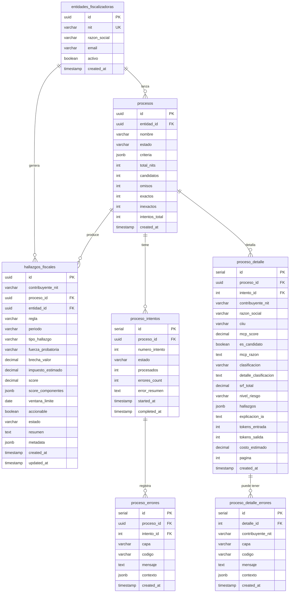
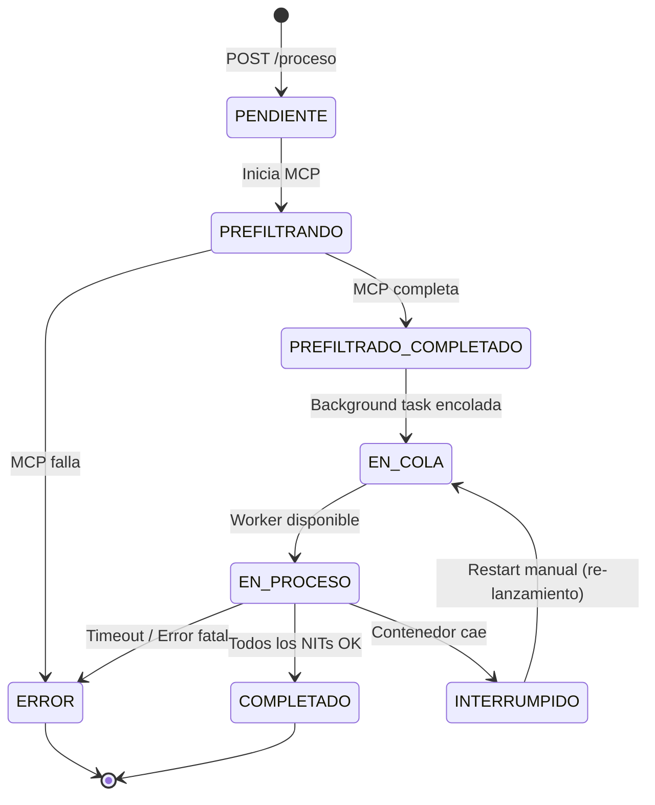

# Modelo de Datos — FiscalIA

> **Nota:** Este documento describe el modelo de datos **PostgreSQL** del microservicio Python, que reemplaza completamente el anterior modelo Oracle (`FISCAL_*` tables). La base de datos Oracle 19c+ del lado de Taxation Smart continúa existiendo como fuente de datos fiscales (consultada vía MCP Server), pero el estado de procesos, resultados MCP y resultados de análisis IA se persisten exclusivamente en PostgreSQL.

## 1. Descripción General

La base de datos PostgreSQL del microservicio consta de **7 tablas principales** que cubren el ciclo de vida completo de un proceso de fiscalización: desde la creación del proceso por parte de una entidad fiscalizadora, pasando por la obtención y clasificación de NITs vía MCP, hasta el análisis con LLM, el registro detallado de errores y la persistencia de hallazgos fiscales.

| Tabla | Propósito | Granularidad |
|-------|-----------|-------------|
| `entidades_fiscalizadoras` | Consumidores de la API (auditores/fiscalizadores) | 1 fila por entidad fiscalizadora |
| `procesos` | Cada criterio de fiscalización ejecutado | 1 fila por proceso |
| `proceso_intentos` | Cada ejecución o re-lanzamiento de un proceso | 1 fila por intento |
| `proceso_detalle` | NITs obtenidos del MCP y analizados por IA | 1 fila por NIT por intento |
| `proceso_errores` | Errores a nivel de proceso por intento | 1 fila por error |
| `proceso_detalle_errores` | Errores por NIT en el detalle | 1 fila por error |
| `hallazgos_fiscales` | Hallazgos fiscales detectados por reglas (R01-R10) | 1 fila por hallazgo |

---

## 2. Tablas

### 2.1. `entidades_fiscalizadoras`

Registra los consumidores de la API — los auditores o fiscalizadores que lanzan procesos de fiscalización.

```sql
CREATE TABLE entidades_fiscalizadoras (
    id UUID PRIMARY KEY DEFAULT gen_random_uuid(),
    nit VARCHAR(20) UNIQUE NOT NULL,
    razon_social VARCHAR(500) NOT NULL,
    email VARCHAR(200),
    activo BOOLEAN DEFAULT TRUE,
    created_at TIMESTAMP DEFAULT NOW()
);
```

| Columna | Tipo | Descripción |
|---------|------|-------------|
| `id` | `UUID` | Identificador único de la entidad, generado automáticamente |
| `nit` | `VARCHAR(20)` | NIT de la entidad fiscalizadora, único |
| `razon_social` | `VARCHAR(500)` | Nombre o razón social de la entidad |
| `email` | `VARCHAR(200)` | Correo electrónico de contacto |
| `activo` | `BOOLEAN` | Indica si la entidad está habilitada para usar la API |
| `created_at` | `TIMESTAMP` | Fecha y hora de registro |

**Índices:**

```sql
CREATE INDEX idx_entidades_nit ON entidades_fiscalizadoras(nit);
```

---

### 2.2. `procesos`

Representa cada conjunto de criterios de fiscalización ejecutado. Un proceso puede tener múltiples intentos (re-lanzamientos).

```sql
CREATE TABLE procesos (
    id UUID PRIMARY KEY DEFAULT gen_random_uuid(),
    entidad_id UUID REFERENCES entidades_fiscalizadoras(id),
    nombre VARCHAR(200) NOT NULL,
    estado VARCHAR(30) NOT NULL DEFAULT 'PENDIENTE',
    criteria JSONB NOT NULL,
    total_nits INTEGER DEFAULT 0,
    candidatos INTEGER DEFAULT 0,
    omisos INTEGER DEFAULT 0,
    exactos INTEGER DEFAULT 0,
    inexactos INTEGER DEFAULT 0,
    intentos_total INTEGER DEFAULT 0,
    created_at TIMESTAMP DEFAULT NOW()
);
```

| Columna | Tipo | Descripción |
|---------|------|-------------|
| `id` | `UUID` | Identificador único del proceso |
| `entidad_id` | `UUID` | FK → `entidades_fiscalizadoras(id)`. Entidad que lanzó el proceso |
| `nombre` | `VARCHAR(200)` | Nombre descriptivo del proceso |
| `estado` | `VARCHAR(30)` | Estado actual del proceso (ver §4) |
| `criteria` | `JSONB` | Criterios de búsqueda (vigencia, régimen, CIIU, período) |
| `total_nits` | `INTEGER` | Total de NITs obtenidos del MCP |
| `candidatos` | `INTEGER` | NITs marcados como candidatos por el MCP |
| `omisos` | `INTEGER` | NITs clasificados como omisos |
| `exactos` | `INTEGER` | NITs clasificados como exactos (descartados) |
| `inexactos` | `INTEGER` | NITs clasificados como inexactos |
| `intentos_total` | `INTEGER` | Número total de intentos acumulados |
| `created_at` | `TIMESTAMP` | Fecha y hora de creación |

**Índices:**

```sql
CREATE INDEX idx_procesos_estado ON procesos(estado);
CREATE INDEX idx_procesos_entidad ON procesos(entidad_id);
```

---

### 2.3. `proceso_intentos`

Cada ejecución o re-lanzamiento de un proceso. Un proceso completado o en error puede ser re-lanzado, generando un nuevo intento con `numero_intento` incremental.

```sql
CREATE TABLE proceso_intentos (
    id SERIAL PRIMARY KEY,
    proceso_id UUID REFERENCES procesos(id),
    numero_intento INTEGER NOT NULL DEFAULT 1,
    estado VARCHAR(30) NOT NULL DEFAULT 'EN_PROCESO',
    procesados INTEGER DEFAULT 0,
    errores_count INTEGER DEFAULT 0,
    error_resumen TEXT,
    started_at TIMESTAMP DEFAULT NOW(),
    completed_at TIMESTAMP
);
```

| Columna | Tipo | Descripción |
|---------|------|-------------|
| `id` | `SERIAL` | Identificador único del intento |
| `proceso_id` | `UUID` | FK → `procesos(id)` |
| `numero_intento` | `INTEGER` | Número secuencial del intento (1, 2, 3...) |
| `estado` | `VARCHAR(30)` | Estado del intento |
| `procesados` | `INTEGER` | NITs procesados exitosamente hasta el momento |
| `errores_count` | `INTEGER` | Cantidad de errores registrados en este intento |
| `error_resumen` | `TEXT` | Resumen del error si el intento falló |
| `started_at` | `TIMESTAMP` | Fecha y hora de inicio del intento |
| `completed_at` | `TIMESTAMP` | Fecha y hora de finalización (nullable mientras está en curso) |

**Índices:**

```sql
CREATE INDEX idx_proceso_intentos_proceso ON proceso_intentos(proceso_id);
CREATE INDEX idx_proceso_intentos_estado ON proceso_intentos(estado);
```

---

### 2.4. `proceso_detalle`

Registro detallado de cada NIT obtenido del MCP, su clasificación (omiso/exacto/inexacto), los resultados del análisis del LLM (hallazgos, SRF, explicación) y métricas de consumo de tokens.

```sql
CREATE TABLE proceso_detalle (
    id SERIAL PRIMARY KEY,
    proceso_id UUID REFERENCES procesos(id),
    intento_id INTEGER REFERENCES proceso_intentos(id),
    contribuyente_nit VARCHAR(20) NOT NULL,
    razon_social VARCHAR(500),
    ciiu VARCHAR(10),
    mcp_score DECIMAL(10,2),
    es_candidato BOOLEAN DEFAULT TRUE,
    mcp_razon TEXT,
    clasificacion VARCHAR(20) NOT NULL,
    detalle_clasificacion TEXT,
    srf_total DECIMAL(5,2),
    nivel_riesgo VARCHAR(10),
    hallazgos JSONB,
    explicacion_ia TEXT,
    tokens_entrada INTEGER,
    tokens_salida INTEGER,
    costo_estimado DECIMAL(10,4),
    pagina INTEGER,
    created_at TIMESTAMP DEFAULT NOW()
);
```

| Columna | Tipo | Descripción |
|---------|------|-------------|
| `id` | `SERIAL` | Identificador único del detalle |
| `proceso_id` | `UUID` | FK → `procesos(id)` |
| `intento_id` | `INTEGER` | FK → `proceso_intentos(id)` |
| `contribuyente_nit` | `VARCHAR(20)` | NIT del contribuyente |
| `razon_social` | `VARCHAR(500)` | Razón social del contribuyente |
| `ciiu` | `VARCHAR(10)` | Código CIIU de la actividad económica |
| `mcp_score` | `DECIMAL(10,2)` | Score/peso asignado por el MCP al contribuyente |
| `es_candidato` | `BOOLEAN` | Indica si el MCP marcó al contribuyente como candidato a fiscalización |
| `mcp_razon` | `TEXT` | Razón proporcionada por el MCP para el score asignado |
| `clasificacion` | `VARCHAR(20)` | Clasificación del NIT: `OMISO`, `EXACTO`, `INEXACTO` |
| `detalle_clasificacion` | `TEXT` | Detalle o justificación de la clasificación |
| `srf_total` | `DECIMAL(5,2)` | Score de Riesgo Fiscal (0.00 — 100.00) |
| `nivel_riesgo` | `VARCHAR(10)` | Nivel de riesgo: `BAJO`, `MEDIO`, `ALTO` |
| `hallazgos` | `JSONB` | Hallazgos estructurados generados por el LLM |
| `explicacion_ia` | `TEXT` | Explicación en lenguaje natural generada por el LLM |
| `tokens_entrada` | `INTEGER` | Tokens consumidos en el prompt enviado al LLM |
| `tokens_salida` | `INTEGER` | Tokens generados en la respuesta del LLM |
| `costo_estimado` | `DECIMAL(10,4)` | Costo estimado en USD del análisis |
| `pagina` | `INTEGER` | Número de página MCP donde se obtuvo este NIT |
| `created_at` | `TIMESTAMP` | Fecha y hora de registro |

**Índices:**

```sql
CREATE INDEX idx_proceso_detalle_proceso ON proceso_detalle(proceso_id);
CREATE INDEX idx_proceso_detalle_intento ON proceso_detalle(intento_id);
CREATE INDEX idx_proceso_detalle_contribuyente ON proceso_detalle(contribuyente_nit);
CREATE INDEX idx_proceso_detalle_clasificacion ON proceso_detalle(clasificacion);
```

---

### 2.5. `proceso_errores`

Errores a nivel de proceso por intento. Captura fallos en la comunicación con MCP, Oracle, LLM, PostgreSQL o en la orquestación general.

```sql
CREATE TABLE proceso_errores (
    id SERIAL PRIMARY KEY,
    proceso_id UUID REFERENCES procesos(id),
    intento_id INTEGER REFERENCES proceso_intentos(id),
    capa VARCHAR(30) NOT NULL,
    codigo VARCHAR(50) NOT NULL,
    mensaje TEXT NOT NULL,
    contexto JSONB,
    created_at TIMESTAMP DEFAULT NOW()
);
```

| Columna | Tipo | Descripción |
|---------|------|-------------|
| `id` | `SERIAL` | Identificador único del error |
| `proceso_id` | `UUID` | FK → `procesos(id)` |
| `intento_id` | `INTEGER` | FK → `proceso_intentos(id)` |
| `capa` | `VARCHAR(30)` | Capa donde se originó el error (ver §6) |
| `codigo` | `VARCHAR(50)` | Código del error (ej: `MCP_TIMEOUT`, `LLM_ALL_PROVIDERS_FAILED`) |
| `mensaje` | `TEXT` | Mensaje descriptivo del error |
| `contexto` | `JSONB` | Contexto adicional estructurado (parámetros, tiempos, proveedores intentados) |
| `created_at` | `TIMESTAMP` | Fecha y hora del error |

**Índices:**

```sql
CREATE INDEX idx_proceso_errores_proceso ON proceso_errores(proceso_id);
CREATE INDEX idx_proceso_errores_intento ON proceso_errores(intento_id);
CREATE INDEX idx_proceso_errores_capa ON proceso_errores(capa);
```

---

### 2.6. `proceso_detalle_errores`

Errores específicos por NIT dentro del detalle de un proceso. Permite granularidad de 1 error por NIT o múltiples errores por NIT según el tipo de fallo.

```sql
CREATE TABLE proceso_detalle_errores (
    id SERIAL PRIMARY KEY,
    detalle_id INTEGER REFERENCES proceso_detalle(id),
    contribuyente_nit VARCHAR(20) NOT NULL,
    capa VARCHAR(30) NOT NULL,
    codigo VARCHAR(50) NOT NULL,
    mensaje TEXT NOT NULL,
    contexto JSONB,
    created_at TIMESTAMP DEFAULT NOW()
);
```

| Columna | Tipo | Descripción |
|---------|------|-------------|
| `id` | `SERIAL` | Identificador único del error |
| `detalle_id` | `INTEGER` | FK → `proceso_detalle(id)` |
| `contribuyente_nit` | `VARCHAR(20)` | NIT del contribuyente asociado al error |
| `capa` | `VARCHAR(30)` | Capa donde se originó el error (ver §6) |
| `codigo` | `VARCHAR(50)` | Código del error |
| `mensaje` | `TEXT` | Mensaje descriptivo del error |
| `contexto` | `JSONB` | Contexto adicional estructurado |
| `created_at` | `TIMESTAMP` | Fecha y hora del error |

**Índices:**

```sql
CREATE INDEX idx_detalle_errores_detalle ON proceso_detalle_errores(detalle_id);
```

---

### 2.7. `hallazgos_fiscales`

Hallazgos fiscales detectados por el motor de reglas (R01-R10). Cada hallazgo representa una inconsistencia o incumplimiento específico por contribuyente y período. Tablas relacionadas: `hallazgo_evidencias`, `hallazgo_revisiones`, `hallazgo_revisiones_agente`.

```sql
CREATE TABLE hallazgos_fiscales (
    id UUID PRIMARY KEY DEFAULT gen_random_uuid(),
    contribuyente_nit VARCHAR(20) NOT NULL,
    proceso_id UUID REFERENCES procesos(id) ON DELETE SET NULL,
    entidad_id UUID REFERENCES entidades_fiscalizadoras(id) ON DELETE SET NULL,
    regla VARCHAR(20) NOT NULL,
    periodo VARCHAR(20) NOT NULL,
    tipo_hallazgo VARCHAR(40) NOT NULL,
    fuerza_probatoria VARCHAR(20) NOT NULL,
    brecha_valor DECIMAL(18,2) DEFAULT 0,
    impuesto_estimado DECIMAL(18,2) DEFAULT 0,
    score DECIMAL(5,2) NOT NULL,
    score_componentes JSONB NOT NULL DEFAULT '{}'::jsonb,
    ventana_limite DATE NOT NULL,
    accionable BOOLEAN NOT NULL DEFAULT TRUE,
    estado VARCHAR(30) NOT NULL DEFAULT 'DETECTADO',
    resumen TEXT,
    metadata JSONB NOT NULL DEFAULT '{}'::jsonb,
    created_at TIMESTAMP DEFAULT NOW(),
    updated_at TIMESTAMP DEFAULT NOW()
);
```

| Columna | Tipo | Descripción |
|---------|------|-------------|
| `id` | `UUID` | Identificador único del hallazgo |
| `contribuyente_nit` | `VARCHAR(20)` | NIT del contribuyente asociado al hallazgo |
| `proceso_id` | `UUID` | FK → `procesos(id)` ON DELETE SET NULL. Proceso que generó el hallazgo |
| `entidad_id` | `UUID` | FK → `entidades_fiscalizadoras(id)` ON DELETE SET NULL. Entidad fiscalizadora |
| `regla` | `VARCHAR(20)` | Código de la regla fiscal que detectó el hallazgo (R01-R10) |
| `periodo` | `VARCHAR(20)` | Período fiscal del hallazgo (YYYY o YYYY-MM) |
| `tipo_hallazgo` | `VARCHAR(40)` | Tipo: `OMISION`, `INCONSISTENCIA_CIIU`, `INCONSISTENCIA_RETENCIONES`, `CAIDA_BSA`, `ANOMALIA_COMPORTAMENTAL` |
| `fuerza_probatoria` | `VARCHAR(20)` | Nivel: `ALTA`, `MEDIA`, `BAJA`. Según fuente y consistencia de los datos |
| `brecha_valor` | `DECIMAL(18,2)` | Diferencia monetaria estimada (COP) entre lo declarado y lo real |
| `impuesto_estimado` | `DECIMAL(18,2)` | Monto estimado del impuesto adeudado (COP) |
| `score` | `DECIMAL(5,2)` | Score de confianza del hallazgo (0.00 a 1.00) |
| `score_componentes` | `JSONB` | Desglose JSON del score: regla, comportamiento, temporal, SRF |
| `ventana_limite` | `DATE` | Fecha límite para acción de fiscalización (prescripción) |
| `accionable` | `BOOLEAN` | TRUE si el hallazgo es accionable para cobro/fiscalización |
| `estado` | `VARCHAR(30)` | Estado: `DETECTADO`, `EN_REVISION`, `CONFIRMADO`, `DESCARTADO`, `PRESCRITO` |
| `resumen` | `TEXT` | Resumen textual del hallazgo generado por IA |
| `metadata` | `JSONB` | Metadatos JSON: cálculos intermedios, datos crudos, config de reglas |
| `created_at` | `TIMESTAMP` | Fecha y hora de creación del hallazgo |
| `updated_at` | `TIMESTAMP` | Fecha y hora de última actualización |

**Foreign Keys:**

| Columna | Referencia | Comportamiento |
|---------|-----------|----------------|
| `proceso_id` | `procesos(id)` | `ON DELETE SET NULL` — el hallazgo sobrevive si se elimina el proceso |
| `entidad_id` | `entidades_fiscalizadoras(id)` | `ON DELETE SET NULL` — el hallazgo sobrevive si se elimina la entidad |

**Índices:**

```sql
CREATE INDEX idx_hallazgos_contribuyente_periodo ON hallazgos_fiscales(contribuyente_nit, periodo);
CREATE INDEX idx_hallazgos_estado_score ON hallazgos_fiscales(estado, score DESC);
CREATE INDEX idx_hallazgos_regla ON hallazgos_fiscales(regla);
CREATE INDEX idx_hallazgos_accionable ON hallazgos_fiscales(accionable);
CREATE INDEX idx_hallazgos_proceso ON hallazgos_fiscales(proceso_id);
CREATE INDEX idx_hallazgos_entidad ON hallazgos_fiscales(entidad_id);
```

---

## 3. Diagrama Entidad-Relación



---

## 4. Ciclo de Vida de los Procesos

### Estados

| Estado | Significado |
|--------|-------------|
| `PENDIENTE` | Proceso creado, esperando ejecución |
| `PREFILTRANDO` | El MCP está obteniendo NITs con paginación |
| `PREFILTRADO_COMPLETADO` | NITs obtenidos y clasificados, análisis IA encolado |
| `EN_COLA` | Esperando worker disponible (Procrastinate) |
| `EN_PROCESO` | Análisis IA en ejecución sobre los NITs |
| `COMPLETADO` | Todos los NITs han sido analizados exitosamente |
| `ERROR` | Error fatal en el proceso (ver `proceso_errores` para detalle) |
| `INTERRUMPIDO` | Contenedor reiniciado mientras el proceso estaba en ejecución. Recuperable mediante re-lanzamiento |

### Máquina de Estados



### Re-lanzamiento

Cuando se envía el mismo `entidad_nit` + mismos `criteria` de un proceso previo:

| Situación | Comportamiento |
|-----------|---------------|
| Proceso `EN_PROCESO` con mismos criteria | Se rechaza con HTTP 409 `PROCESO_EN_PROCESO` |
| Proceso `COMPLETADO` o `ERROR` con mismos criteria | Se crea nuevo `proceso_intentos` con `numero_intento` incremental |
| Historial de intentos anteriores | Se preserva para consulta y auditoría |

---

## 5. Política de Retención de Datos

| Tabla | Retención | Acción |
|-------|-----------|--------|
| `procesos` | 2 años | DELETE después de 2 años |
| `proceso_intentos` | 2 años | DELETE en cascada desde `procesos` |
| `proceso_detalle` | 2 años | DELETE en cascada desde `procesos` |
| `proceso_errores` | 1 año | DELETE después de 1 año |
| `proceso_detalle_errores` | 1 año | DELETE después de 1 año |
| `entidades_fiscalizadoras` | Indefinido | Nunca se eliminan (son cuentas de entidades fiscalizadoras) |
| Logs de aplicación | 6 meses | Rotación / archivado |

**Implementación:** Job mensual en PostgreSQL (cron o pg_timetable) que ejecuta las limpiezas según las ventanas de retención definidas.

---

## 6. Clasificación de Errores por Capa

El modelo utiliza una arquitectura hexagonal/DDD donde cada error se clasifica según la capa donde se originó, permitiendo filtrado granular en consultas y monitoreo.

| Capa | Códigos de ejemplo | Descripción |
|------|--------------------|-------------|
| `MCP` | `MCP_TIMEOUT`, `MCP_CONN_REFUSED`, `MCP_PAGE_ERROR` | Errores de conexión o comunicación con el MCP Server (FastMCP stdio) |
| `ORACLE` | `ORACLE_QUERY_FAIL`, `ORACLE_TIMEOUT`, `ORACLE_NIT_NOT_FOUND` | Errores en consultas a Oracle Database 19c+ (datos fiscales) |
| `LLM` | `LLM_TIMEOUT`, `LLM_RATE_LIMIT`, `LLM_INVALID_JSON`, `LLM_ALL_PROVIDERS_FAILED` | Errores en API de proveedores LLM (cualquier tier) |
| `POSTGRES` | `PG_CONN_ERROR`, `PG_INSERT_FAIL` | Errores de persistencia en PostgreSQL |
| `VALIDACION` | `CRITERIOS_INVALIDOS`, `NIT_NO_ENCONTRADO` | Errores de validación de entrada en los endpoints |
| `PROCESO` | `WORKER_TIMEOUT`, `ORCHESTRATION_FAIL` | Errores de orquestación general de procesos |

### Granularidad de errores por detalle

| Tipo de error | Granularidad | Ejemplo |
|---------------|-------------|---------|
| Timeout LLM para un NIT (todos los providers fallaron) | 1 error por NIT | `LLM_ALL_PROVIDERS_FAILED` |
| Datos faltantes del MCP | 1 error por NIT | `MCP_DATA_INCOMPLETE` |
| NIT no encontrado en Oracle | 1 error por NIT | `ORACLE_NIT_NOT_FOUND` |
| Múltiples validaciones fallidas | Múltiples por NIT | `VALIDACION_CIIU` + `VALIDACION_PERIODO` |

---

## 7. DDL Completo

El script DDL completo se encuentra en:

```
db/migrations/001_create_tables.sql
```

Incluye la creación de todas las tablas, relaciones, índices y la política de retención (job mensual).
