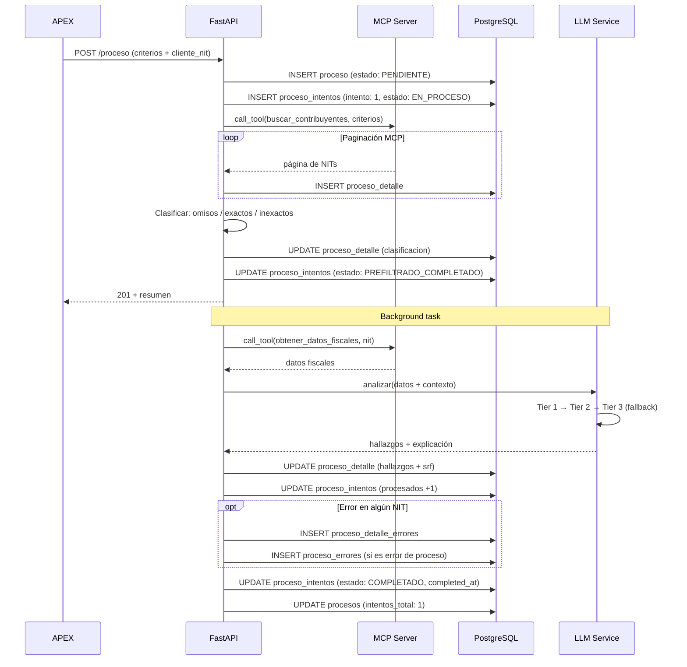
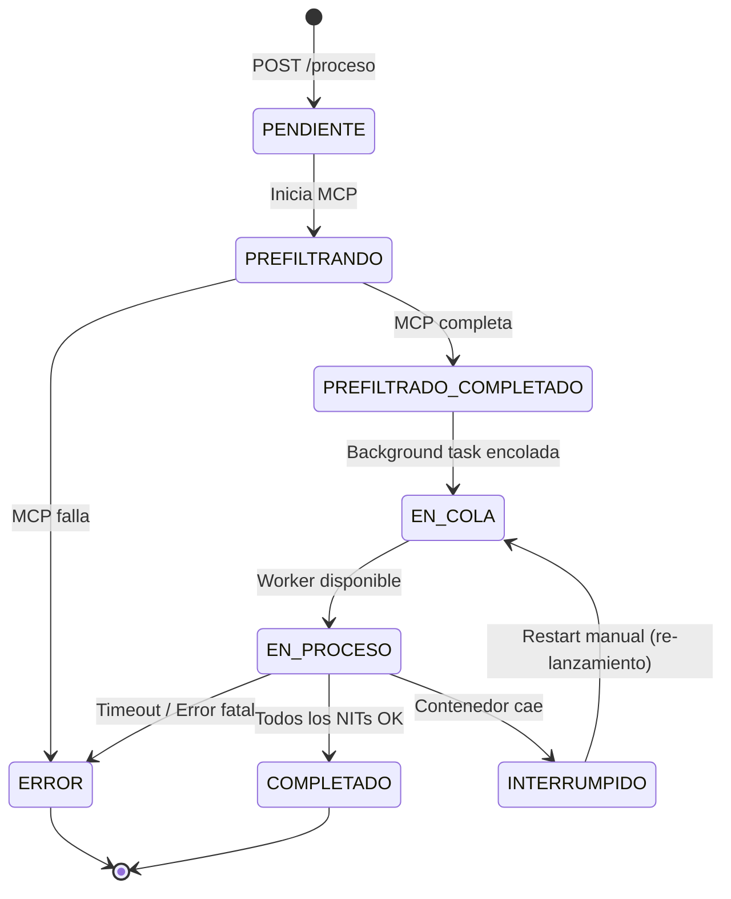
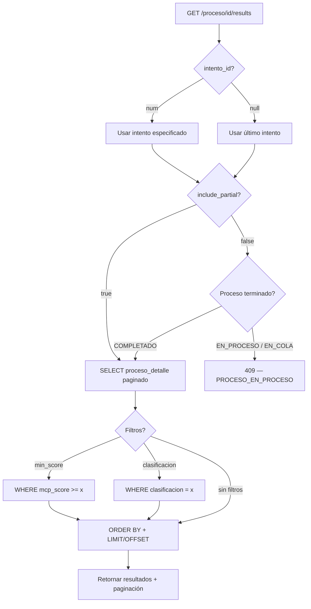

# API Endpoints — FiscalIA

## 1. POST /proceso — Crear proceso asíncrono

**Request:**

```json
{
  "cliente_nit": "9003189639",
  "nombre": "Proceso Comercio Q1 2024",
  "vigencia_ini": "2024-01-01",
  "vigencia_fin": "2024-12-31",
  "tipo_regimen": "COMUN",
  "actividades_economicas": ["4711", "4712", "4721"],
  "periodo": "2024"
}
```

**Response (201):**

```json
{
  "proceso_id": "uuid-o-id-12345",
  "intento_id": 1,
  "estado": "PREFILTRADO_COMPLETADO",
  "nombre": "Proceso Comercio Q1 2024",
  "cliente_nit": "9003189639",
  "resumen": {
    "total_nits": 8500,
    "omisos": 1200,
    "exactos": 6300,
    "inexactos": 1000
  },
  "proceso_analisis": {
    "estado": "EN_COLA",
    "mensaje": "Pre-filtrado completado en 18s. Análisis IA en background."
  },
  "created_at": "2026-06-21T10:30:00Z"
}
```

**Re-lanzamiento:** Si se envía el mismo `cliente_nit` + mismos `criteria`, se detecta como re-lanzamiento y se crea un nuevo `proceso_intentos` con `numero_intento` incremental.

**Lógica de re-lanzamiento:**

| Aspecto | Comportamiento |
|---|---|
| Detección | Comparación de `cliente_nit` + hash de `criteria` (JSON deep equality) |
| Si hay proceso `EN_PROCESO` con mismos criteria | Se rechaza con 409 `PROCESO_EN_PROCESO` |
| Si hay proceso `COMPLETADO`/`ERROR` con mismos criteria | Se crea nuevo intento con `numero_intento` incremental |
| Resultados anteriores | Se preservan (historial de intentos) |
| Re-solo NITs fallidos | **No soportado en V1** — se re-ejecutan todos |

**Background task mechanism:**

| Aspecto | Decisión |
|---|---|
| **Recomendado** | **Procrastinate** — cola de tareas basada en PostgreSQL (sin infra extra) |
| Alternativa simple | `asyncio.create_task()` — tasks en memoria (se pierden si el contenedor cae) |
| ~~No usar~~ | ~~Celery/ARQ + Redis~~ — sobre-ingeniería para este caso |
| Límite concurrencia | Max 5 procesos simultáneos (configurable via `MAX_CONCURRENT_PROCESSES`) |
| Timeout proceso | 30 min por proceso (configurable via `PROCESS_TIMEOUT_MINUTES`) |
| Persistencia | Procrastinate almacena tasks en PostgreSQL → sobreviven reinicios |
| Retry | Automático con backoff (3 intentos) |
| Cancelación | No expuesta en V1 (futuro: `DELETE /proceso/{id}`) |

**Flujo interno:**



---

## 2. GET /proceso/{id}/status — Consultar estado

**Response (200):**

```json
{
  "proceso_id": "uuid-o-id-12345",
  "estado": "EN_PROCESO",
  "cliente_nit": "9003189639",
  "intento_actual": {
    "numero": 2,
    "estado": "EN_PROCESO",
    "procesados": 995,
    "errores": 3
  },
  "intentos_historial": [
    { "numero": 1, "estado": "ERROR", "errores_count": 12, "started_at": "2026-06-20T10:00:00Z" },
    { "numero": 2, "estado": "EN_PROCESO", "errores_count": 3, "started_at": "2026-06-21T10:30:05Z" }
  ],
  "progreso": {
    "porcentaje": 45.2,
    "total_nits": 2200,
    "procesados": 995,
    "faltantes": 1205
  },
  "clasificacion": {
    "omisos": { "total": 1200, "procesados": 600 },
    "inexactos": { "total": 1000, "procesados": 395 }
  },
  "started_at": "2026-06-21T10:30:05Z",
  "ultimo_update": "2026-06-21T10:35:12Z"
}
```

**Estados posibles:**

| Estado | Significado |
|---|---|
| `PENDIENTE` | Proceso creado, esperando ejecución |
| `PREFILTRANDO` | MCP está obteniendo NITs |
| `PREFILTRADO_COMPLETADO` | NITs clasificados, análisis IA en cola |
| `EN_COLA` | Esperando worker disponible |
| `EN_PROCESO` | Análisis IA en ejecución |
| `COMPLETADO` | Todos los NITs analizados |
| `INTERRUMPIDO` | Contenedor reiniciado mid-process (recuperable) |
| `ERROR` | Error en el proceso (detalle en proceso_errores) |

**Máquina de estados:**



---

## 3. GET /proceso/{id}/results — Consultar resultados

**Query parameters:**

| Parámetro | Tipo | Default | Descripción |
|---|---|---|---|
| `page` | int | 1 | Número de página |
| `page_size` | int | 50 | Registros por página (max 500) |
| `intento_id` | int | null | Filtrar por intento específico (si null, usa el último intento) |
| `include_partial` | boolean | false | Si true, retorna resultados parciales aunque el proceso no haya terminado |
| `clasificacion` | string | null | Filtro: `OMISO`, `EXACTO`, `INEXACTO` |
| `min_score` | float | null | Filtrar por score mínimo del MCP |
| `ordenar_por` | string | `mcp_score` | Campo de ordenamiento: `mcp_score`, `nit`, `created_at` |
| `direccion` | string | `desc` | `asc` o `desc` |

**Response (200) — Proceso completado:**

```json
{
  "proceso_id": "uuid-o-id-12345",
  "estado": "COMPLETADO",
  "intento_id": 2,
  "paginacion": {
    "page": 1,
    "page_size": 50,
    "total_registros": 2200,
    "total_paginas": 44
  },
  "resultados": [
    {
      "nit": "9003189639",
      "razon_social": "COMERCIO XYZ S.A.S.",
      "ciiu": "4711",
      "clasificacion": "INEXACTO",
      "mcp_score": 85.5,
      "mcp_razon": "Diferencia de ingresos del 45%",
      "srf_total": 78,
      "nivel_riesgo": "ALTO",
      "hallazgos": [
        {
          "tipo": "SUBDECLARACION_EXOGENA",
          "declarado_ica": 50000000,
          "exogena": 120000000,
          "diferencia": 70000000,
          "variacion_pct": 140,
          "explicacion_ia": "El contribuyente declaró $50M en ICA..."
        }
      ],
      "explicacion_ia": "Contribuyente con alto riesgo de subdeclaración..."
    }
  ]
}
```

**Response (200) — Con include_partial=true (proceso en curso):**

```json
{
  "proceso_id": "uuid-o-id-12345",
  "estado": "EN_PROCESO",
  "intento_id": 2,
  "parcial": true,
  "paginacion": {
    "page": 1,
    "page_size": 50,
    "total_registros": 995,
    "total_paginas": 20
  },
  "resultados": [...]
}
```

**Response (409) — Sin include_partial y proceso en curso:**

```json
{
  "error": "PROCESO_EN_PROCESO",
  "mensaje": "El proceso aún no ha terminado. Use include_partial=true para ver resultados parciales.",
  "estado": "EN_PROCESO",
  "progreso": {
    "porcentaje": 45.2,
    "procesados": 995,
    "faltantes": 1205
  }
}
```

**Flujo del endpoint:**



---

## 4. GET /proceso/{id}/errors — Consultar errores

**Query parameters:**

| Parámetro | Tipo | Default | Descripción |
|---|---|---|---|
| `intento_id` | int | null | Filtrar por intento (si null, muestra todos) |
| `capa` | string | null | Filtrar por capa: `MCP`, `ORACLE`, `LLM`, `POSTGRES`, `VALIDACION`, `PROCESO` |
| `nit` | string | null | Filtrar errores de detalle por NIT |

**Response (200):**

```json
{
  "proceso_id": "uuid-o-id-12345",
  "errores_proceso": [
    {
      "id": 1,
      "intento_id": 1,
      "capa": "MCP",
      "codigo": "MCP_TIMEOUT",
      "mensaje": "Timeout al conectar con MCP Server después de 30s",
      "contexto": { "pagina": 15, "timeout_ms": 30000 },
      "created_at": "2026-06-20T10:05:00Z"
    }
  ],
  "errores_detalle": [
    {
      "nit": "9003189639",
      "capa": "LLM",
      "codigo": "LLM_TIMEOUT",
      "mensaje": "Timeout al analizar contribuyente con LLM (Tier 1: anthropic, Tier 2: nvidia_nim)",
      "contexto": { "tokens_entrada": 2500, "timeout_ms": 60000, "provider_intentado": "anthropic" },
      "created_at": "2026-06-20T10:10:00Z"
    }
  ],
  "total_errores_proceso": 1,
  "total_errores_detalle": 5
}
```

---

## 5. POST /analizar/{nit} — Análisis individual

**Request:**

```json
{
  "cliente_nit": "9003189639",
  "nit_objetivo": "9012345678",
  "periodo": "2024"
}
```

| Parámetro | Tipo | Requerido | Descripción |
|---|---|---|---|
| `nit_objetivo` | string | Sí | NIT del contribuyente a analizar (path param) |
| `cliente_nit` | string | Sí | NIT del cliente que solicita (auditor) |
| `periodo` | string | No | Año fiscal a analizar (default: año actual) |

**Response (200):**

```json
{
  "nit": "9012345678",
  "razon_social": "COMERCIO XYZ S.A.S.",
  "ciiu": "4711",
  "clasificacion": "INEXACTO",
  "mcp_score": 85.5,
  "mcp_razon": "Diferencia de ingresos del 45%",
  "srf_total": 78,
  "nivel_riesgo": "ALTO",
  "hallazgos": [
    {
      "tipo": "SUBDECLARACION_EXOGENA",
      "declarado_ica": 50000000,
      "exogena": 120000000,
      "diferencia": 70000000,
      "variacion_pct": 140,
      "explicacion_ia": "El contribuyente declaró $50M en ICA..."
    }
  ],
  "explicacion_ia": "Contribuyente con alto riesgo de subdeclaración...",
  "tokens_utilizados": 2500,
  "duracion_ms": 45000,
  "provider_utilizado": "anthropic"
}
```

**Response (404):**

```json
{
  "error": "NIT_NO_ENCONTRADO",
  "mensaje": "El NIT 9012345678 no fue encontrado en el padrón de contribuyentes"
}
```

**Response (429):**

```json
{
  "error": "RATE_LIMIT_EXCEEDED",
  "mensaje": "Límite de requests excedido. Intente en 60 segundos."
}
```

**Comportamiento:**

| Aspecto | Detalle |
|---|---|
| Timeout | 90 segundos max (RNF-01) |
| Fallback LLM | Se aplica la misma cadena de 3 tiers |
| No usa background | Ejecución sincrónica — espera resultado |
| No crea proceso | No inserta en `procesos` — es análisis on-demand |
| Cache | Si el mismo NIT + periodo fue analizado en < 1h, retorna cache |
| Errores | Si el NIT no tiene datos MCP, retorna 404 con explicación |

---

## 18. Seguridad y Operaciones

> **Modelo de seguridad:** Solo red privada OCI. Sin autenticación por API key — APEX es el único consumidor y accede vía red interna.

### Rate Limiting

| Endpoint | Límite | Ventana |
|---|---|---|
| `POST /proceso` | 10 requests | por minuto por IP |
| `GET /proceso/{id}/status` | 60 requests | por minuto por IP |
| `GET /proceso/{id}/results` | 30 requests | por minuto por IP |
| `GET /proceso/{id}/errors` | 30 requests | por minuto por IP |
| `POST /analizar/{nit}` | 5 requests | por minuto por IP |
| `GET /health` | Sin límite | — |

**Implementación:** In-memory rate limiter (V1). Futuro: Redis.
