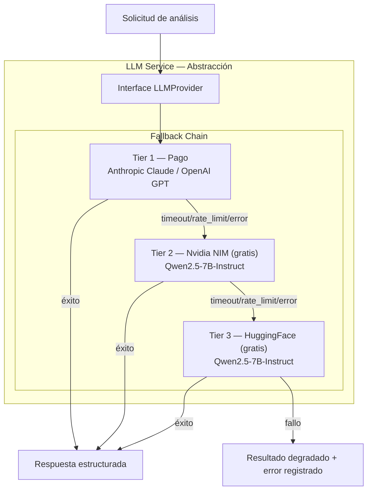

# Configuración LLM — FiscalIA

> **Nota:** Esta arquitectura reemplaza el diseño anterior basado en litellm. Se adopta un enfoque con interface `LLMProvider` propia y cadena de fallback de 3 niveles (Tier 1 pago → Tier 2 NVIDIA NIM → Tier 3 HuggingFace), eliminando la dependencia directa de litellm comoProxy unificador.

## 1. Chat Fiscalizador Asistido

**Qué hace:** LLM genera explicaciones en lenguaje natural de hallazgos y SRF.
**Implementación:** Microservicio OCI (Python) → LLM Service (provider agnostic)
**Nota:** No es un chat interactivo; son explicaciones generadas automáticamente y presentadas en APEX.

## 2. LLM Service — Arquitectura Provider Agnostic con Fallback

**Qué hace:** Abstrae la conexión con proveedores LLM para ser agnóstico al modelo/proveedor, con sistema de fallback de 3 niveles.

**Diseño:**



**Interfaz común (todos los providers implementan esto):**

```python
class LLMProvider(ABC):
    @abstractmethod
    async def chat(self, messages: list[dict], **kwargs) -> LLMResponse: ...

    @abstractmethod
    async def chat_json(self, messages: list[dict], schema: dict) -> dict: ...
```

**Cadena de fallback:**

| Prioridad | Provider | Tipo | Modelo Recomendado | API Compatible |
|---|---|---|---|---|
| Tier 1 | Anthropic | Pago | claude-sonnet-4-20250506 | Anthropic SDK |
| Tier 1 | OpenAI | Pago | gpt-4o | OpenAI SDK |
| Tier 2 | Nvidia NIM | Gratis (5K credits) | qwen/qwen2.5-7b-instruct | OpenAI-compatible |
| Tier 3 | HuggingFace | Gratis (créditos mensuales) | Qwen/Qwen2.5-7B-Instruct | OpenAI-compatible |

### Tier 1 — Pago (Anthropic / OpenAI)

| Aspecto | Anthropic Claude | OpenAI GPT |
|---|---|---|
| Modelo principal | claude-sonnet-4-20250506 | gpt-4o |
| Fortaleza | Razonamiento complejo, análisis profundo | Speed, menor costo |
| Costo estimado | ~$3/1M input, ~$15/1M output | ~$2.50/1M input, ~$10/1M output |
| Registro | console.anthropic.com | platform.openai.com |
| Recomendación | **Default** — mejor calidad para análisis fiscal | Alternativa — menor costo, buena calidad |

> **Guidance:** Usar Anthropic Claude como Tier 1 default. Cambiar a OpenAI GPT si se requiere menor latencia o el costo de Claude excede el presupuesto. La variable `LLM_TIER1_PROVIDER` en `.env` controla cuál se usa.

### Tier 2 — Nvidia NIM (Gratis)

| Aspecto | Detalle |
|---|---|
| Créditos gratuitos | 5.000 API credits totales (1.000 al registrar + 4.000 con email empresarial) |
| Rate limit | **40 RPM** (requests por minuto) por modelo |
| API | OpenAI-compatible (`https://integrate.api.nvidia.com/v1`) |
| Registro | NVIDIA Developer Program (gratis): developer.nvidia.com |
| API key | build.nvidia.com → Profile → API Catalog |
| Vigencia | Mientras duren los créditos; sin expiración para Developer Program |
| Production | Requiere NVIDIA AI Enterprise license o self-hosting |

> **Nota:** Los 5.000 credits son suficientes para ~2.500-5.000 análisis dependiendo del tamaño del prompt. Para procesos batch de 10K NITs, considerar auto-hosting o usar Tier 1.

### Tier 3 — HuggingFace Inference Providers (Gratis)

| Aspecto | Detalle |
|---|---|
| Créditos gratuitos | Créditos mensuales gratuitos (varía por tipo de cuenta) |
| API | OpenAI-compatible (`https://api-inference.huggingface.co/v1`) |
| Providers disponibles | SambaNova, Together AI, Fireworks AI, Nebius, Novita |
| Registro | huggingface.co → Settings → Access Tokens |
| API key | Token con permisos "Inference Providers" |
| Selección de provider | El sistema selecciona automáticamente el más rápido (política `:fastest`) |
| Production | Disponible vía pago por uso en providers partners |

> **Nota:** HuggingFace actúa como orquestador de providers. El mismo modelo (Qwen2.5-7B) corre en múltiples providers, y HF selecciona el más rápido automáticamente.

### Fallback Logic (pseudocódigo)

```python
async def analyze_with_fallback(messages, schema):
    providers = [
        PrimaryProvider(),    # Tier 1: Claude o GPT
        NvidiaNIMProvider(),  # Tier 2: Qwen2.5-7B vía NIM
        HuggingFaceProvider() # Tier 3: Qwen2.5-7B vía HF
    ]
    for provider in providers:
        try:
            return await provider.chat_json(messages, schema)
        except (TimeoutError, RateLimitError, APIError) as e:
            log.warning(f"Fallback: {provider.name} failed: {e}")
            continue
    raise AllProvidersFailedError()
```

### Qwen2.5-7B-Instruct — Justificación (Tiers 2 y 3)

| Benchmark | Qwen2.5-7B | Llama-3.1-8B | Nota |
|---|---|---|---|
| IFEval multilingual | **74.87** | 60.68 | +23% mejor en instruction following |
| JSON output | Optimizado | Base | Qwen2.5 tiene mejora explícita para JSON |
| Idiomas | 29+ (incl. español) | 8 | Mejor cobertura multilingüe |
| Contexto | 128K tokens | 128K | Igual |
| Tamaño | 7B params | 8B | Más ligero, menor latencia |

- Instrucción following mejorado vs versiones anteriores
- Contexto de 128K tokens
- Disponible gratis en ambas plataformas (Nvidia NIM + HuggingFace)

> **Nota sobre casing del modelo Qwen:** Nvidia NIM usa `qwen/qwen2.5-7b-instruct` (minúsculas) como identificador del modelo, mientras que HuggingFace usa `Qwen/Qwen2.5-7B-Instruct` (PascalCase). Cada plataforma tiene su propia convención; los valores en `.env` reflejan el formato exacto que cada API espera.

## 3. Gestión de Prompts

**Ubicación:** `microservice/llm/prompts.py` — módulo Python con templates.

**Diseño:**

```python
# prompts.py
PROMPT_ANALISIS_OMISO = """
Eres un experto en fiscalización tributaria municipal de Valledupar, Colombia.
Analiza el siguiente contribuyente OMISO en el pago del ICA...

Datos del contribuyente:
{datos_fiscales}

Genera un JSON con la siguiente estructura:
{schema}
"""

PROMPT_ANALISIS_INEXACTO = """
Eres un experto en fiscalización tributaria municipal de Valledupar, Colombia.
Analiza las siguientes INCONSISTENCIAS en la declaración de ICA...

Datos del contribuyente:
{datos_fiscales}

Inconsistencias detectadas:
{inconsistencias}

Genera un JSON con la siguiente estructura:
{schema}
"""

PROMPT_SRF_EXPLICACION = """
Explica en lenguaje simple por qué este contribuyente tiene un Score de Riesgo Fiscal de {srf_total}/100.
Top 3 factores de mayor peso:
{factores}
"""
```

**Versionado:**

| Aspecto | Estrategia |
|---|---|
| Almacenamiento | Archivos `.py` con constantes string (V1) |
| Versionado | Git history — cada cambio de prompt es un commit |
| naming | `PROMPT_{TIPO}_{VERSION}` (ej: `PROMPT_OMISO_V2`) |
| Testing | Tests unitarios validan que el prompt genera JSON válido |
| A/B testing | **No soportado en V1** — futuro con DB de prompts |

**Tipos de prompt:**

| Prompt | Uso | Input | Output esperado |
|---|---|---|---|
| `PROMPT_ANALISIS_OMISO` | Análisis de contribuyente sin declaración | Datos fiscales MCP | JSON: brecha fiscal, explicación, recomendación |
| `PROMPT_ANALISIS_INEXACTO` | Análisis de inconsistencias | Datos fiscales + declaraciones | JSON: hallazgos, tipos, valores, explicación |
| `PROMPT_SRF_EXPLICACION` | Explicación del SRF en lenguaje natural | Score + factores | Texto: explicación para el fiscalizador |
| `PROMPT_CLASIFICACION` | Clasificar NIT en omiso/exacto/inexacto | Datos MCP + criterios | JSON: clasificación + razón |

## Variables de Entorno

### Descubrimiento Automático (Recomendado)

Los modelos se descubren automáticamente consultando la API de cada proveedor al iniciar.
No es necesario configurar `LLM_TIER*_MODEL`:

```env
# === LLM Tier 1 (NVIDIA NIM) ===
LLM_TIER1_PROVIDER=nvidia_nim
LLM_TIER1_API_KEY=nvapi-...
# LLM_TIER1_MODEL=  # Opcional: se descubre automáticamente

# === LLM Tier 2 (Nvidia NIM, gratis) ===
LLM_TIER2_API_KEY=nvapi-...
# LLM_TIER2_MODEL=  # Opcional: se descubre automáticamente

# === LLM Tier 3 (HuggingFace, gratis) ===
LLM_TIER3_API_KEY=hf_...
# LLM_TIER3_MODEL=  # Opcional: se descubre automáticamente
```

### Configuración Manual (Opcional)

Si se requiere forzar un modelo específico, configurar `LLM_TIER*_MODEL`:

```env
# === LLM Tier 1 (pago) ===
LLM_TIER1_PROVIDER=anthropic
LLM_TIER1_API_KEY=sk-ant-...
LLM_TIER1_MODEL=claude-sonnet-4-20250506

# === LLM Tier 2 (Nvidia NIM, gratis) ===
LLM_TIER2_API_KEY=nvapi-...
LLM_TIER2_MODEL=meta/llama-3.1-8b-instruct
LLM_TIER2_BASE_URL=https://integrate.api.nvidia.com/v1

# === LLM Tier 3 (HuggingFace, gratis) ===
LLM_TIER3_API_KEY=hf_...
LLM_TIER3_MODEL=Qwen/Qwen2.5-7B-Instruct
LLM_TIER3_BASE_URL=https://api-inference.huggingface.co/v1
```

| Variable | Descripción | Ejemplo |
|---|---|---|
| `LLM_TIER1_PROVIDER` | Proveedor primario: `anthropic` o `openai` | `nvidia_nim` |
| `LLM_TIER1_API_KEY` | API key de Anthropic o OpenAI | `sk-ant-...` |
| `LLM_TIER1_MODEL` | Modelo del Tier 1 (opcional) | `claude-sonnet-4-20250506` |
| `LLM_TIER2_API_KEY` | API key de NVIDIA Developer Program | `nvapi-...` |
| `LLM_TIER2_MODEL` | Modelo en Nvidia NIM (opcional) | `meta/llama-3.1-8b-instruct` |
| `LLM_TIER2_BASE_URL` | Endpoint de Nvidia NIM | `https://integrate.api.nvidia.com/v1` |
| `LLM_TIER3_API_KEY` | Token de HuggingFace Inference Providers | `hf_...` |
| `LLM_TIER3_MODEL` | Modelo en HuggingFace (opcional) | `Qwen/Qwen2.5-7B-Instruct` |
| `LLM_TIER3_BASE_URL` | Endpoint de HuggingFace | `https://api-inference.huggingface.co/v1` |

## Retry Config

| Parámetro | Valor | Descripción |
|---|---|---|
| `LLM_TIMEOUT_SECONDS` | 60 | Timeout por llamada individual a un provider |
| `LLM_MAX_RETRIES_PER_PROVIDER` | 3 | Intentos antes de pasar al siguiente tier |
| `LLM_RETRY_BACKOFF_FACTOR` | 2 | Factor exponencial: 1s, 2s, 4s |
| `LLM_RETRY_MAX_WAIT` | 10 | Espera máxima entre reintentos (segundos) |

Implementado con `tenacity`:

```python
@tenacity.retry(
    stop=stop_after_attempt(settings.LLM_MAX_RETRIES_PER_PROVIDER),
    wait=wait_exponential(
        multiplier=settings.LLM_RETRY_BACKOFF_FACTOR,
        max=settings.LLM_RETRY_MAX_WAIT
    ),
    retry=(retry_if_exception_type(TimeoutError) |
           retry_if_exception_type(RateLimitError) |
           retry_if_exception_type(APIError)),
)
async def call_provider(messages, schema):
    return await provider.chat_json(messages, schema)
```

## Estrategia de Degradación

Cuando todos los providers en la cadena de fallback fallan:

1. El NIT se marca con `LLM_ALL_PROVIDERS_FAILED` en `proceso_detalle_errores`
2. Se registra el error con la capa `LLM` y el detalle de qué providers se intentaron
3. El campo `explicacion_ia` queda como `null` o con un mensaje de degradación
4. El proceso continúa con el siguiente NIT (no se aborta el batch)
5. El `proceso_intentos` registra el error a nivel de resumen

```python
try:
    return await analyze_with_fallback(messages, schema)
except AllProvidersFailedError as e:
    log.error(f"NIT {nit}: all LLM providers failed", extra={
        "nit": nit,
        "providers_intentados": e.providers_tried
    })
    await db.insert_error(
        detalle_id=detalle_id,
        nit=nit,
        capa="LLM",
        codigo="LLM_ALL_PROVIDERS_FAILED",
        mensaje=f"Todos los providers fallaron: {', '.join(e.providers_tried)}",
        contexto={"providers_intentados": e.providers_tried}
    )
    return {
        "explicacion_ia": None,
        "hallazgos": [],
        "srf_total": None,
        "nivel_riesgo": "NO_DETERMINADO"
    }
```

Overhead máximo por switch entre tiers: < 5 segundos (RNF-12).
