# Manual de Implementación — FiscalIA API

> **Versión:** 2.0.0  
> **Última actualización:** Julio 2026  
> **Arquitectura:** Hexagonal (Ports & Adapters) + DDD  
> **Stack:** Python 3.12+ / FastAPI / asyncpg / PostgreSQL 16+

---

## Tabla de Contenidos

1. [Descripción General](#1-descripción-general)
2. [Arquitectura](#2-arquitectura)
3. [Prerrequisitos](#3-prerrequisitos)
4. [Instalación Local](#4-instalación-local)
5. [Configuración de Variables de Entorno](#5-configuración-de-variables-de-entorno)
6. [Base de Datos PostgreSQL](#6-base-de-datos-postgresql)
7. [API Endpoints](#7-api-endpoints)
8. [Ejemplos de Uso](#8-ejemplos-de-uso)
9. [Sistema de Fallback LLM](#9-sistema-de-fallback-llm)
10. [Despliegue en OCI](#10-despliegue-en-oci)
11. [Monitoreo y Alarmas](#11-monitoreo-y-alarmas)
12. [Troubleshooting](#12-troubleshooting)

---

## 1. Descripción General

FiscalIA es un microservicio de IA para la fiscalización del ICA (Impuesto de Industria, Comercio y Oficios Varios) en Valledupar, Colombia. Orquesta agentes de IA para:

- **Pre-filtrado masivo:** Obtención y clasificación de contribuyentes vía Oracle Database directo (oracledb)
- **Análisis individual/batch:** Evaluación fiscal con LLM (fallback de 3 niveles)
- **Detección de hallazgos:** Motor de reglas fiscales (R01-R10) con fuerza probatoria
- **Análisis comportamental:** Detección de patrones anómalos entre contribuyentes
- **Gestión de expedientes:** Ciclo de vida completo de hallazgos fiscales (DETECTADO → CONFIRMADO)

**Modelo de seguridad:** Solo red privada OCI. APEX es el único consumidor vía red interna.

---

## 2. Arquitectura

### 2.1. Diagrama de Capas

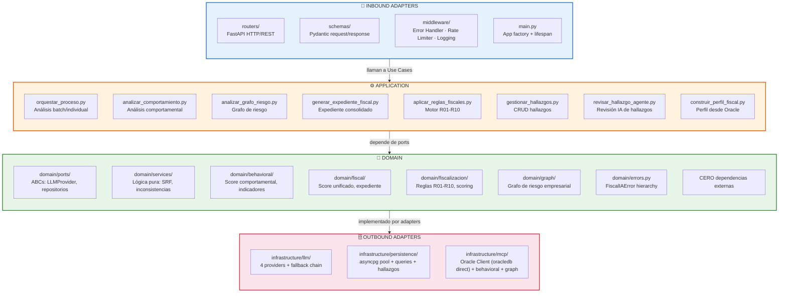

### 2.2. Árbol del Proyecto

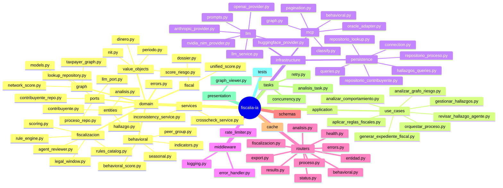

---

## 3. Prerrequisitos

| Requisito | Versión mínima | Notas |
|---|---|---|
| Python | 3.12+ | Recomendado: 3.12 |
| PostgreSQL | 16+ | asyncpg pool asíncrono |
| pip | 24+ | Gestor de paquetes |
| Git | 2.x | Control de versiones |
| Docker | 24+ (opcional) | Para despliegue |
| Oracle Client | oracledb | Conexión directa a Oracle 19c+ |

### API Keys necesarias

| Servicio | Tier | Obligatorio | Registro |
|---|---|---|---|
| Anthropic | Tier 1 (pago) | Sí (mínimo 1 tier) | console.anthropic.com |
| OpenAI | Tier 1 (pago) | Alternativa a Anthropic | platform.openai.com |
| NVIDIA NIM | Tier 2 (gratis) | No (fallback) | developer.nvidia.com |
| HuggingFace | Tier 3 (gratis) | No (fallback) | huggingface.co |

---

## 4. Instalación Local

### 4.1. Clonar el repositorio

```bash
git clone <repo-url> fiscalia-ia
cd fiscalia-ia
```

### 4.2. Crear entorno virtual

```bash
python -m venv .venv

# Windows
.venv\Scripts\activate

# Linux/Mac
source .venv/bin/activate
```

### 4.3. Instalar dependencias

```bash
pip install -r microservice/requirements.txt
```

### 4.4. Configurar variables de entorno

```bash
cp .env.example .env
# Editar .env con tus valores reales (ver §5)
```

### 4.5. Verificar instalación

```bash
# Linting
ruff check microservice/ tests/

# Tests unitarios
PYTHONPATH=microservice pytest tests/unit/ -v

# Cobertura
PYTHONPATH=microservice pytest tests/unit/ --cov=microservice --cov-report=term
```

### 4.6. Ejecutar el servidor

```bash
# Desde la raíz del proyecto
uvicorn main:app --reload --host 0.0.0.0 --port 8000
```

El servidor estará disponible en:
- **API:** http://localhost:8000
- **Swagger UI:** http://localhost:8000/docs
- **ReDoc:** http://localhost:8000/redoc

---

## 5. Configuración de Variables de Entorno

### 5.1. Variables Obligatorias

```env
# === PostgreSQL ===
POSTGRES_HOST=localhost
POSTGRES_PORT=5432
POSTGRES_DB=fiscalia
POSTGRES_USER=fiscalia
POSTGRES_PASSWORD=tu_password_real

# === LLM Tier 1 (mínimo 1 proveedor) ===
LLM_TIER1_PROVIDER=anthropic
LLM_TIER1_API_KEY=sk-ant-...
LLM_TIER1_MODEL=claude-sonnet-4-20250506
```

### 5.2. Variables Opcionales (con defaults)

```env
# === API ===
API_PORT=8000
API_HOST=0.0.0.0

# === Municipio ===
MUNICIPIO=Valledupar
DEPARTAMENTO=Cesar

# === Cache ===
CACHE_TTL_SECONDS=3600    # 1 hora

# === Retry / Timeouts ===
LLM_TIMEOUT=0             # 0 = sin limite
RETRY_MAX_ATTEMPTS=1
RETRY_BACKOFF_FACTOR=2
RETRY_TIMEOUT=0

# === Performance ===
NIT_CONCURRENCY=5
BATCH_DB_SIZE=50

# === Pool PostgreSQL ===
POOL_MIN_SIZE=4
POOL_MAX_SIZE=20
POOL_TIMEOUT=5

# === Background Tasks ===
MAX_CONCURRENT_PROCESSES=5
PROCESS_TIMEOUT_MINUTES=0

# === Oracle Database ===
ORACLE_HOST=138.121.200.30
ORACLE_PORT=1521
ORACLE_SERVICE=ORCLPDB
ORACLE_USER=FISCALIA_APP
ORACLE_PASSWORD=changeme
ORACLE_POOL_MIN=2
ORACLE_POOL_MAX=5
ORACLE_POOL_TIMEOUT=30

# === Log ===
LOG_LEVEL=INFO
```

### 5.3. Validación al Startup

`config.py` valida automáticamente que ninguna API key ni contraseña tenga el valor `"changeme"`. Si se detecta, lanza `ConfiguracionInvalidaError` con el nombre de la variable ofensiva.

**Nunca** comitear el archivo `.env` al repositorio (está en `.gitignore`).

### 5.4. Configuración por Ambiente

| Ambiente | `LOG_LEVEL` | `CACHE_TTL` | `MAX_CONCURRENT_PROCESSES` |
|---|---|---|---|
| Desarrollo | `DEBUG` | `60` (1 min) | `2` |
| Pruebas | `INFO` | `300` (5 min) | `5` |
| Producción | `INFO` | `3600` (1 hr) | `5` |

---

## 6. Base de Datos PostgreSQL

### 6.1. Tablas del Sistema

| Tabla | Propósito | Granularidad |
|-------|-----------|-------------|
| `entidades_fiscalizadoras` | Consumidores de la API | 1 fila por entidad |
| `procesos` | Cada criterio de fiscalización | 1 fila por proceso |
| `proceso_intentos` | Cada ejecución/re-lanzamiento | 1 fila por intento |
| `proceso_detalle` | NITs analizados por IA | 1 fila por NIT por intento |
| `proceso_errores` | Errores a nivel de proceso | 1 fila por error |
| `proceso_detalle_errores` | Errores por NIT | 1 fila por error |
| `hallazgos_fiscales` | Hallazgos detectados (R01-R10) | 1 fila por hallazgo |

### 6.2. Diagrama ER

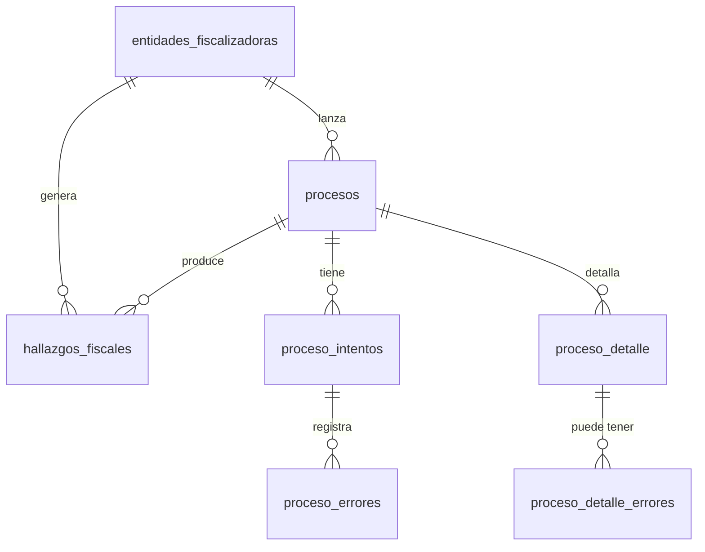

### 6.3. Ejecutar Migraciones

```bash
# Conectar a PostgreSQL y ejecutar DDL
psql -h localhost -U fiscalia -d fiscalia -f db/migrations/001_create_tables.sql
```

### 6.4. Política de Retención

| Tabla | Retención | Acción |
|-------|-----------|--------|
| `procesos`, `proceso_intentos`, `proceso_detalle` | 2 años | DELETE en cascada |
| `proceso_errores`, `proceso_detalle_errores` | 1 año | DELETE |
| `entidades_fiscalizadoras` | Indefinido | Nunca se eliminan |

---

## 7. API Endpoints

**Base URL:** `http://localhost:8000/api/v1`

### 7.1. Health Check

| Método | Ruta | Descripción |
|--------|------|-------------|
| `GET` | `/health` | Estado del servicio |

**Response (200):**
```json
{
  "status": "healthy",
  "database": "connected",
  "oracle": "connected",
  "version": "2.0.0"
}
```

**Flujo del health check:**

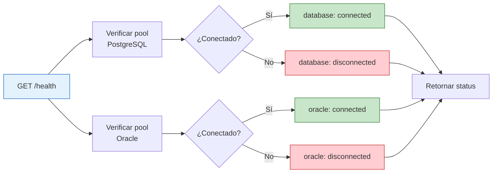

---

### 7.2. Entidades Fiscalizadoras

| Método | Ruta | Descripción |
|--------|------|-------------|
| `POST` | `/entidad_fiscalizadora` | Crear entidad |
| `GET` | `/entidad_fiscalizadora/{nit}` | Obtener entidad por NIT |
| `GET` | `/entidades_fiscalizadoras` | Listar entidades (paginado) |

**POST /entidad_fiscalizadora — Request:**
```json
{
  "entidad_nit": "9003189639",
  "nombre": "Municipio de Valledupar",
  "email": "fiscalizacion@valledupar.gov.co"
}
```

**Response (201):**
```json
{
  "id": "uuid-de-la-entidad",
  "entidad_nit": "9003189639",
  "nombre": "Municipio de Valledupar",
  "email": "fiscalizacion@valledupar.gov.co",
  "activo": true
}
```

---

### 7.3. Procesos de Fiscalización

| Método | Ruta | Descripción |
|--------|------|-------------|
| `POST` | `/proceso` | Crear proceso asíncrono |
| `GET` | `/proceso/{id}/status` | Consultar estado |
| `GET` | `/proceso/{id}/results` | Consultar resultados (paginado) |
| `GET` | `/proceso/{id}/errors` | Consultar errores |
| `GET` | `/proceso/{id}/export` | Exportar a XLSX |

#### POST /proceso — Crear proceso asíncrono

**Request:**
```json
{
  "entidad_nit": "9003189639",
  "nombre": "Proceso Comercio Q1 2024",
  "vigencia_ini": "2024-01-01",
  "vigencia_fin": "2024-12-31",
  "tipo_regimen": "COMUN",
  "actividades_economicas": ["4711", "4712", "4721"],
  "periodo": "2024",
  "tipo": "COMPLETO",
  "max_nits": 0,
  "umbral_retenciones_pct": 5.0
}
```

| Parámetro | Tipo | Default | Requerido | Descripción |
|---|---|---|---|---|
| `entidad_nit` | string | — | Sí | NIT de la entidad fiscalizadora |
| `nombre` | string | — | Sí | Nombre descriptivo del proceso |
| `vigencia_ini` | string | — | Sí | Fecha inicial del período (YYYY-MM-DD) |
| `vigencia_fin` | string | — | Sí | Fecha final del período (YYYY-MM-DD) |
| `tipo_regimen` | string | — | Sí | COMUN / SIMPLIFICADO |
| `actividades_economicas` | string[] | — | Sí | Lista de códigos CIIU |
| `periodo` | string | — | Sí | Año fiscal |
| `tipo` | string | `BASICO` | No | `BASICO` = SRF+LLM (paralelo), `COMPLETO` = BASICO + comportamiento + reglas + score + resumen |
| `max_nits` | int | 0 | No | Límite de NITs a procesar (0 = ilimitado) |
| `umbral_retenciones_pct` | float | 5.0 | No | Umbral porcentual para inexactos retenciones |

**Response (201):**
```json
{
  "proceso_id": "uuid-del-proceso",
  "intento_id": 1,
  "estado": "EN_COLA",
  "nombre": "Proceso Comercio Q1 2024",
  "entidad_nit": "9003189639",
  "resumen": {
    "total_nits": 0,
    "omisos": 0,
    "exactos": 0,
    "inexactos": 0
  },
  "proceso_analisis": {
    "estado": "EN_COLA",
    "mensaje": "Proceso creado. Iniciando pre-filtrado de candidatos en Oracle."
  },
  "created_at": "2026-06-21T10:30:00Z"
}
```

**Cancelación:** Endpoint `POST /proceso/{proceso_id}/cancelar` disponible. Marca el proceso como `INTERRUMPIDO` y cancela la tarea activa via `asyncio.CancelledError`.

**Re-lanzamiento:**
| Situación | Comportamiento |
|-----------|---------------|
| Proceso `EN_PROCESO` con mismos criteria | HTTP 409 `PROCESO_EN_PROCESO` |
| Proceso `COMPLETADO`/`ERROR` con mismos criteria | Nuevo intento con `numero_intento` incremental |
| Resultados anteriores | Se preservan (historial) |

**Flujo interno de POST /proceso:**

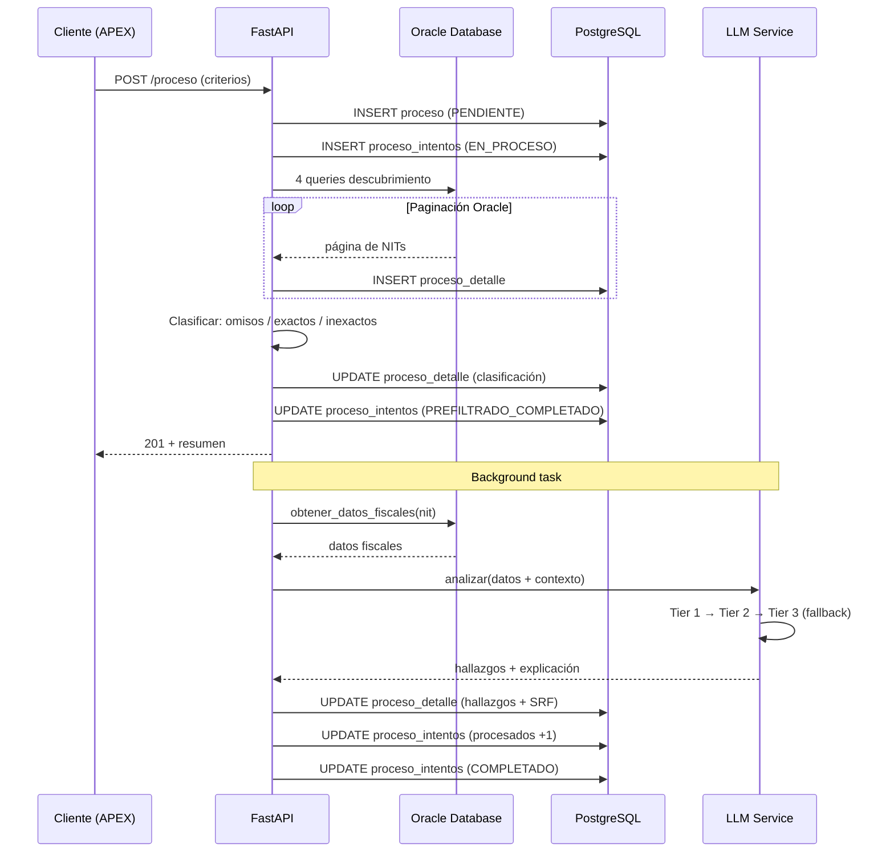

#### GET /proceso/{id}/status — Consultar estado

**Response (200):**
```json
{
  "proceso_id": "uuid-o-id-12345",
  "estado": "EN_PROCESO",
  "entidad_nit": "9003189639",
  "intento_actual": {
    "numero": 2,
    "estado": "EN_PROCESO",
    "procesados": 995,
    "errores": 3
  },
  "progreso": {
    "porcentaje": 45.2,
    "total_nits": 2200,
    "procesados": 995,
    "faltantes": 1205
  },
  "clasificacion": {
    "omisos": { "total": 1200, "procesados": 600 },
    "inexactos": { "total": 1000, "procesados": 395 }
  }
}
```

**Estados posibles:**

| Estado | Significado |
|--------|-------------|
| `PENDIENTE` | Proceso creado, esperando ejecución |
| `PREFILTRANDO` | MCP está obteniendo NITs |
| `PREFILTRADO_COMPLETADO` | NITs clasificados, análisis IA en cola |
| `EN_COLA` | Esperando worker disponible |
| `EN_PROCESO` | Análisis IA en ejecución |
| `COMPLETADO` | Todos los NITs analizados |
| `INTERRUMPIDO` | Contenedor reiniciado mid-process (recuperable) |
| `ERROR` | Error en el proceso |

**Máquina de estados:**

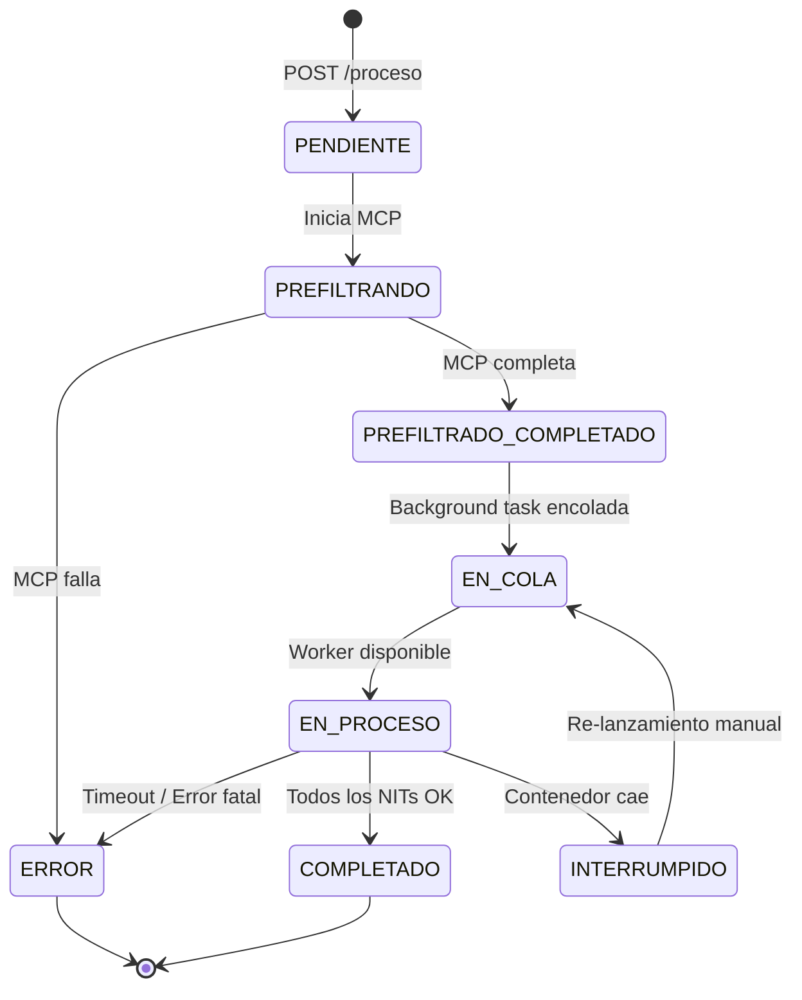

#### GET /proceso/{id}/results — Consultar resultados

**Query parameters:**

| Parámetro | Tipo | Default | Descripción |
|---|---|---|---|
| `page` | int | 1 | Número de página |
| `page_size` | int | 50 | Registros por página (max 500) |
| `intento_id` | int | null | Filtrar por intento específico |
| `include_partial` | boolean | false | Retornar resultados parciales |
| `clasificacion` | string | null | `OMISO`, `EXACTO`, `INEXACTO` |
| `min_score` | float | null | Score mínimo del MCP |
| `ordenar_por` | string | `mcp_score` | Campo de ordenamiento |
| `direccion` | string | `desc` | `asc` o `desc` |

**Response (200):**
```json
{
  "proceso_id": "uuid-o-id-12345",
  "estado": "COMPLETADO",
  "intento_id": 2,
  "paginacion": {
    "page": 1,
    "page_size": 50,
    "total_registros": 2200,
    "total_paginas": 44
  },
  "resultados": [
    {
      "contribuyente_nit": "9003189639",
      "razon_social": "COMERCIO XYZ S.A.S.",
      "ciiu": "4711",
      "clasificacion": "INEXACTO",
      "mcp_score": 85.5,
      "mcp_razon": "Diferencia de ingresos del 45%",
      "srf_total": 78,
      "nivel_riesgo": "ALTO",
      "hallazgos": [
        {
          "tipo": "SUBDECLARACION_EXOGENA",
          "declarado_ica": 50000000,
          "exogena": 120000000,
          "diferencia": 70000000,
          "variacion_pct": 140,
          "explicacion_ia": "El contribuyente declaró $50M en ICA..."
        }
      ],
      "explicacion_ia": "Contribuyente con alto riesgo de subdeclaración..."
    }
  ]
}
```

#### GET /proceso/{id}/errors — Consultar errores

**Query parameters:**

| Parámetro | Tipo | Default | Descripción |
|---|---|---|---|
| `intento_id` | int | null | Filtrar por intento |
| `capa` | string | null | `MCP`, `ORACLE`, `LLM`, `POSTGRES`, `VALIDACION`, `PROCESO` |
| `nit` | string | null | Filtrar por NIT |

**Response (200):**
```json
{
  "proceso_id": "uuid-o-id-12345",
  "errores_proceso": [...],
  "errores_detalle": [...],
  "total_errores_proceso": 1,
  "total_errores_detalle": 5
}
```

#### GET /proceso/{id}/export — Exportar a XLSX

Descarga un archivo Excel con los resultados del proceso.

**Query parameters:**

| Parámetro | Tipo | Default | Descripción |
|---|---|---|---|
| `formato` | string | `xlsx` | Formato de exportación |

**Response:** Archivo `.xlsx` con dos hojas:
- **Resumen:** ID, estado, totales
- **Resultados Campana:** NIT, razón social, CIIU, clasificación, scores, hallazgos, explicación IA

**Flujo de exportación:**

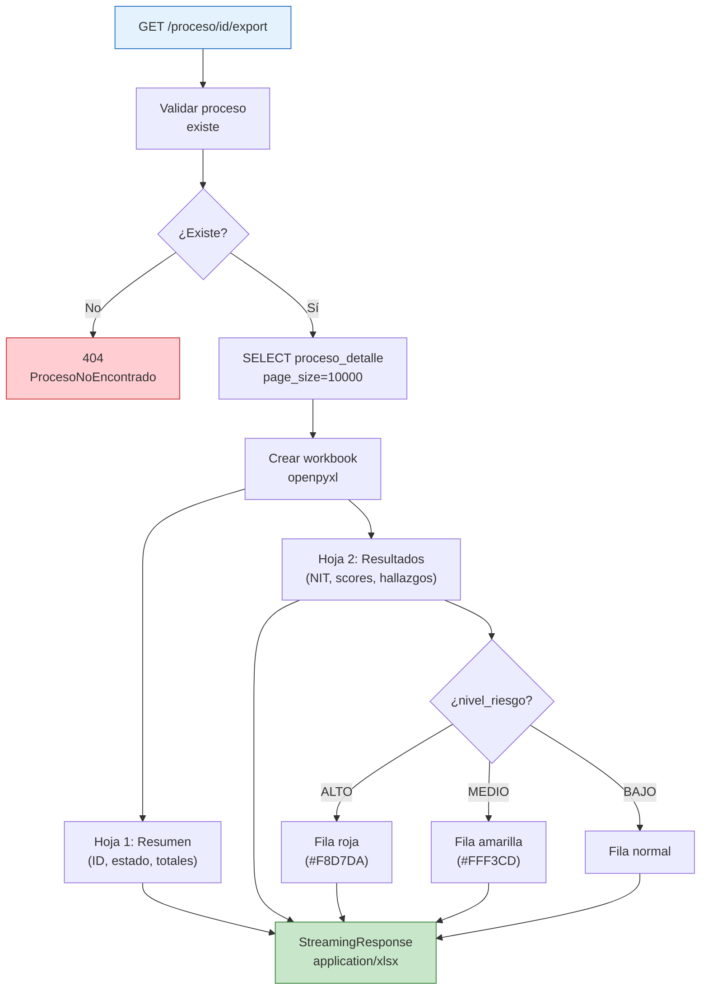

**Flujo de consulta de resultados:**

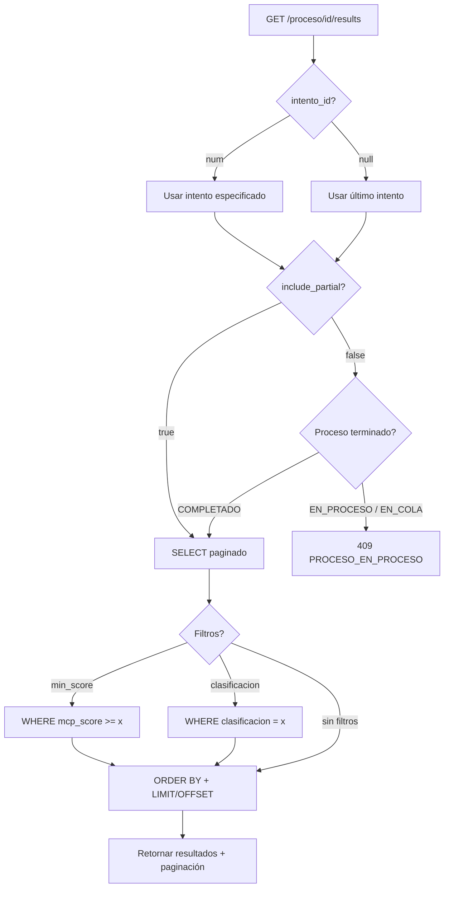

---

### 7.4. Análisis Individual

| Método | Ruta | Descripción |
|--------|------|-------------|
| `POST` | `/analizar/{contribuyente_nit}?periodo=2024` | Análisis on-demand (sin body) |

**Parámetros:**

| Parámetro | Tipo | Default | Requerido | Descripción |
|---|---|---|---|---|
| `contribuyente_nit` | string | — | Sí (path) | NIT del contribuyente a analizar |
| `periodo` | string | `2024` | No (query) | Año fiscal a analizar |

**Sin body** — el NIT va como path param y el período como query param.

**Response (200):**
```json
{
  "contribuyente_nit": "9012345678",
  "razon_social": "COMERCIO XYZ S.A.S.",
  "ciiu": "4711",
  "clasificacion": "INEXACTO",
  "mcp_score": 85.5,
  "mcp_razon": "",
  "srf_total": 78,
  "componentes_srf": [
    { "nombre": "consistencia", "valor": 80, "peso": 0.3 },
    { "nombre": "historial", "valor": 75, "peso": 0.4 },
    { "nombre": "declaracion", "valor": 82, "peso": 0.3 }
  ],
  "nivel_riesgo": "ALTO",
  "hallazgos": [...],
  "explicacion_ia": "Contribuyente con alto riesgo de subdeclaración...",
  "tokens_utilizados": 2500,
  "duracion_ms": 45000,
  "provider_utilizado": "anthropic",
  "cache_hit": false
}
```

**Comportamiento:**
- Timeout: 90 segundos máximo
- Cache: Si el mismo NIT + periodo fue analizado en < 1h, retorna cache
- No crea proceso en `procesos` (es análisis on-demand)

**Flujo del análisis individual:**

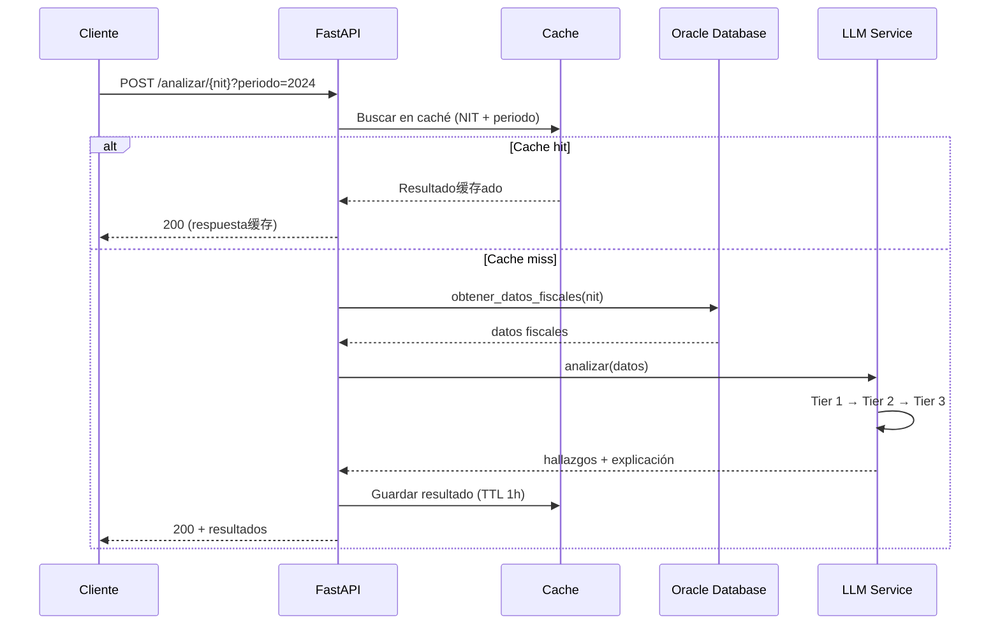

---

### 7.5. Análisis Comportamental

| Método | Ruta | Descripción |
|--------|------|-------------|
| `GET` | `/contribuyente/{nit}/comportamiento` | Análisis comportamental individual |
| `GET` | `/proceso/{id}/ranking-comportamental` | Ranking comportamental del proceso |
| `GET` | `/contribuyente/{nit}/grafo-riesgo` | Grafo de riesgo |
| `GET` | `/contribuyente/{nit}/expediente-fiscal` | Expediente fiscal consolidado |
| `GET` | `/visor/grafo/{nit}` | Visor HTML del grafo |

#### GET /contribuyente/{nit}/comportamiento

**Query parameters:**

| Parámetro | Tipo | Default | Descripción |
|---|---|---|---|
| `periodo` | string | `2024` | Año fiscal |
| `ciiu` | string | null | Filtro por código CIIU |
| `regimen` | string | null | Filtro por régimen |
| `min_pares` | int | `10` | Mínimo de pares comparables (3-100) |

#### GET /contribuyente/{nit}/grafo-riesgo

**Query parameters:**

| Parámetro | Tipo | Default | Descripción |
|---|---|---|---|
| `periodo` | string | `2024` | Año fiscal |
| `min_pares` | int | `10` | Mínimo de pares (3-100) |
| `incluir_comportamiento` | bool | `true` | Incluir datos comportamentales |

---

### 7.6. Fiscalización (Reglas R01-R10)

| Método | Ruta | Descripción |
|--------|------|-------------|
| `POST` | `/fiscalizacion/reglas/evaluar` | Evaluar reglas sin persistir |
| `POST` | `/fiscalizacion/reglas/evaluar/{nit}` | Evaluar reglas por NIT |
| `POST` | `/fiscalizacion/reglas/ejecutar` | Ejecutar reglas y crear hallazgos |
| `POST` | `/fiscalizacion/reglas/ejecutar/{nit}` | Ejecutar reglas por NIT |
| `POST` | `/fiscalizacion/hallazgos` | Crear hallazgo manual |
| `POST` | `/fiscalizacion/hallazgos/desde-grafo/{nit}` | Crear hallazgo desde grafo |
| `GET` | `/fiscalizacion/hallazgos` | Listar hallazgos (paginado) |
| `GET` | `/fiscalizacion/hallazgos/{id}` | Obtener hallazgo |
| `POST` | `/fiscalizacion/hallazgos/{id}/revision` | Revisar hallazgo (humano) |
| `POST` | `/fiscalizacion/hallazgos/{id}/revision-agente` | Revisar hallazgo con IA |

#### POST /fiscalizacion/reglas/evaluar/{nit}

Evalúa las reglas fiscales para un NIT específico sin persistir resultados.

**Query parameters:**

| Parámetro | Tipo | Default | Descripción |
|---|---|---|---|
| `periodo` | string | `2024` | Período fiscal |
| `reglas` | list | null | Filtrar reglas específicas (R01, R02, etc.) |

**Response (200):**
```json
{
  "total": 3,
  "resultados": [
    {
      "regla": "R01",
      "tipo_hallazgo": "OMISION",
      "fuerza_probatoria": "DIRECTA",
      "brecha_valor": 15000000,
      "score": 0.85
    }
  ]
}
```

#### GET /fiscalizacion/hallazgos — Listar hallazgos

**Query parameters:**

| Parámetro | Tipo | Default | Descripción |
|---|---|---|---|
| `estado` | string | null | `DETECTADO`, `EN_REVISION`, `CONFIRMADO`, `DESCARTADO` |
| `regla` | string | null | Filtrar por regla (R01-R10) |
| `contribuyente_nit` | string | null | Filtrar por NIT |
| `accionable` | bool | null | Solo accionables |
| `page` | int | 1 | Página |
| `page_size` | int | 50 | Registros por página (max 200) |

**Flujo del motor de reglas fiscales:**

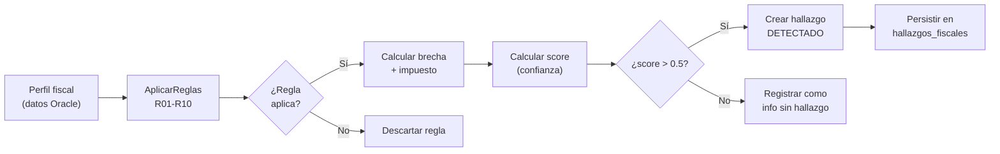

---

## 8. Ejemplos de Uso

### 8.1. curl — Crear proceso

```bash
curl -X POST http://localhost:8000/api/v1/proceso \
  -H "Content-Type: application/json" \
  -d '{
    "entidad_nit": "9003189639",
    "nombre": "Proceso Comercio Q1 2024",
    "vigencia_ini": "2024-01-01",
    "vigencia_fin": "2024-12-31",
    "tipo_regimen": "COMUN",
    "actividades_economicas": ["4711", "4712"],
    "periodo": "2024",
    "tipo": "COMPLETO",
    "max_nits": 0,
    "umbral_retenciones_pct": 5.0
  }'
```

### 8.2. curl — Consultar estado

```bash
curl http://localhost:8000/api/v1/proceso/{proceso_id}/status
```

### 8.3. curl — Consultar resultados

```bash
curl "http://localhost:8000/api/v1/proceso/{proceso_id}/results?page=1&page_size=20&clasificacion=INEXACTO"
```

### 8.4. curl — Análisis individual

```bash
curl -X POST "http://localhost:8000/api/v1/analizar/9012345678?periodo=2024"
```

### 8.5. curl — Evaluar reglas fiscales

```bash
curl -X POST "http://localhost:8000/api/v1/fiscalizacion/reglas/evaluar/9012345678?periodo=2024"
```

### 8.6. curl — Exportar resultados

```bash
curl -o resultados.xlsx "http://localhost:8000/api/v1/proceso/{proceso_id}/export?formato=xlsx"
```

### 8.7. Python — Conexión desde APEX/vía requests

```python
import requests

BASE_URL = "http://localhost:8000/api/v1"

# Crear proceso
response = requests.post(f"{BASE_URL}/proceso", json={
    "entidad_nit": "9003189639",
    "nombre": "Auditoría Q1 2024",
    "vigencia_ini": "2024-01-01",
    "vigencia_fin": "2024-12-31",
    "periodo": "2024",
    "tipo": "COMPLETO",
    "max_nits": 0,
    "umbral_retenciones_pct": 5.0
})
proceso_id = response.json()["proceso_id"]

# Polling de estado
import time
while True:
    status = requests.get(f"{BASE_URL}/proceso/{proceso_id}/status").json()
    if status["estado"] in ("COMPLETADO", "ERROR"):
        break
    time.sleep(5)

# Obtener resultados
results = requests.get(f"{BASE_URL}/proceso/{proceso_id}/results").json()
```

### 8.8. PL/SQL — Desde Oracle APEX

```sql
DECLARE
    l_response CLOB;
BEGIN
    l_response := apex_web_service.make_rest_request(
        p_url         => 'http://<container-ip>:8000/api/v1/analizar/9012345678?periodo=2024',
        p_http_method => 'POST'
    );
END;
```

---

## 9. Sistema de Fallback LLM

### 9.1. Cadena de Fallback

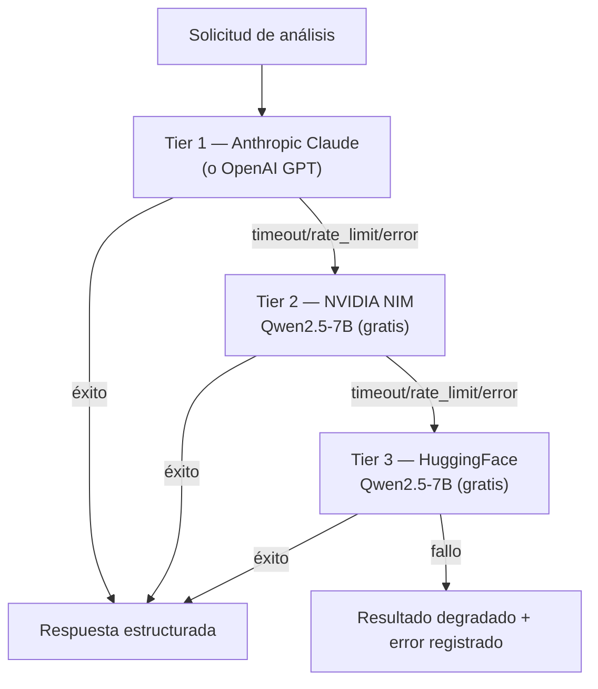

### 9.2. Configuración de Providers

| Prioridad | Provider | Tipo | Modelo | API |
|---|---|---|---|---|
| Tier 1 | Anthropic | Pago | claude-sonnet-4-20250506 | Anthropic SDK |
| Tier 1 | OpenAI | Pago | gpt-4o | OpenAI SDK |
| Tier 2 | NVIDIA NIM | Gratis (5K credits) | qwen/qwen2.5-7b-instruct | OpenAI-compatible |
| Tier 3 | HuggingFace | Gratis (créditos mensuales) | Qwen/Qwen2.5-7B-Instruct | OpenAI-compatible |

### 9.3. Retry con Tenacity

```python
@tenacity.retry(
    stop=stop_after_attempt(3),
    wait=wait_exponential(multiplier=2, max=10),
    retry=(retry_if_exception_type(TimeoutError) |
           retry_if_exception_type(RateLimitError) |
           retry_if_exception_type(APIError)),
)
async def call_provider(messages, schema):
    return await provider.chat_json(messages, schema)
```

### 9.4. Estrategia de Degradación

Cuando todos los providers fallan:
1. El NIT se marca con `LLM_ALL_PROVIDERS_FAILED` en `proceso_detalle_errores`
2. `explicacion_ia` queda como `null`
3. El proceso continúa con el siguiente NIT (no se aborta el batch)

---

## 10. Despliegue en OCI

### 10.1. Build de la Imagen Docker

```bash
# Construir
docker build -t iat/fiscalia-ia:latest .

# Taggear para OCI Registry
docker tag iat/fiscalia-ia:latest <region>.ocir.io/<namespace>/fiscalia-ia:latest

# Push
docker push <region>.ocir.io/<namespace>/fiscalia-ia:latest
```

### 10.2. Configuración OCI Container Instance

| Configuración | Valor |
|---|---|
| **VCN** | VCN existente del proyecto Taxation Smart |
| **Subred** | Privada (sin IP pública) |
| **NSG** | Regla de entrada solo desde IPs de APEX |
| **Puerto** | 8000 |
| **CPU** | 1 OCPU |
| **Memoria** | 8 GB |
| **Disco** | 10 GB |
| **Instancias** | 1 (V1) |

**Arquitectura de despliegue:**

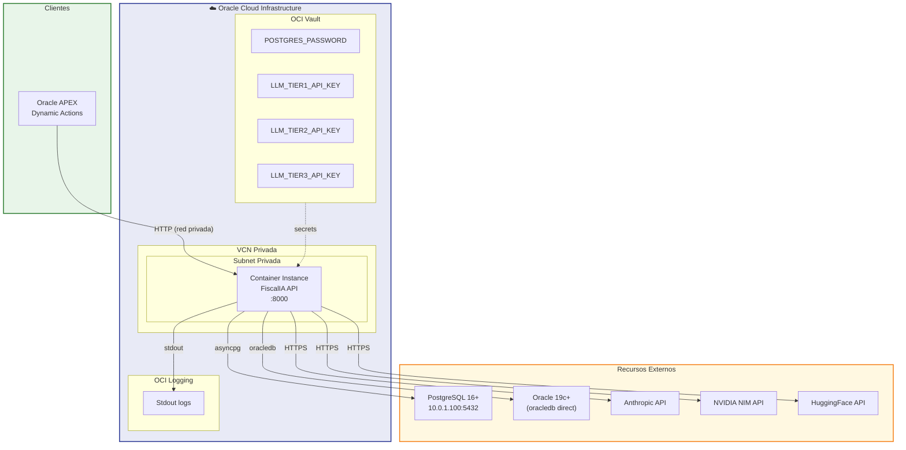

### 10.3. Health Check

```
Ruta:       /api/v1/health
Puerto:     8000
Intervalo:  30s
Timeout:    10s
Umbral:     3 intentos fallidos
```

### 10.4. Variables en OCI Vault

Configurar todas las variables sensibles en **OCI Vault**, nunca en texto plano:
- `POSTGRES_PASSWORD`
- `LLM_TIER1_API_KEY`
- `LLM_TIER2_API_KEY`
- `LLM_TIER3_API_KEY`
- `ORACLE_PASSWORD`

---

## 11. Monitoreo y Alarmas

### 11.1. Logs

- OCI Logging recibe stdout del contenedor
- Cada análisis genera log estructurado: `nit`, `periodo`, `tiempo_ms`, `tokens`, `cache_hit`, `provider`

### 11.2. Métricas Clave

| Métrica | Target |
|---|---|
| Latencia POST /proceso | < 30s |
| Latencia POST /analizar/{nit} | < 90s |
| Cache hit ratio | > 30% |
| Errores 5xx | < 1% |
| Tokens consumidos/mes | Monitorear |

### 11.3. Alarmas Sugeridas

| Alarma | Umbral | Acción |
|---|---|---|
| Latencia > 90s | > 3 en 5 min | Notificar equipo |
| Errores 5xx | > 5 en 5 min | Notificar equipo |
| PostgreSQL caído | 1 ocurrencia | Notificar equipo |
| Costo LLM mensual | > $100 USD | Revisar uso |

---

## 12. Troubleshooting

### Errores Comunes

| Error | Causa | Solución |
|---|---|---|
| `ConfiguracionInvalidaError` | API key o password = "changeme" | Editar `.env` con valores reales |
| `PG_CONN_ERROR` | PostgreSQL no accesible | Verificar `POSTGRES_HOST`, firewall, pg_hba.conf |
| `MCP_TIMEOUT` | Oracle Database no responde | Verificar conexión oracledb, firewall, configuración Oracle |
| `ORACLE_NIT_NOT_FOUND` | NIT no encontrado en Oracle | Verificar el NIT en el padrón de contribuyentes |
| `LLM_ALL_PROVIDERS_FAILED` | Todos los LLM fallaron | Verificar API keys, créditos, rate limits |
| `PROCESO_EN_PROCESO` | Re-lanzar proceso en ejecución | Esperar a que termine o usar `include_partial=true` |
| `NIT_NO_ENCONTRADO` | NIT no existe en Oracle | Verificar el NIT en la fuente de datos |

### Comandos Útiles

```bash
# Ver logs en tiempo real
docker logs -f <container-id>

# Verificar conexión PostgreSQL
psql -h localhost -U fiscalia -d fiscalia -c "SELECT 1"

# Verificar pool de conexiones
curl http://localhost:8000/api/v1/health

# Tests de regresión
PYTHONPATH=microservice pytest tests/unit/ -v --tb=short

# Linting
ruff check microservice/ tests/
ruff format --check microservice/ tests/
```

---

## Rate Limiting

| Endpoint | Límite | Ventana |
|---|---|---|
| `POST /proceso` | 10 req | por minuto por IP |
| `GET /proceso/{id}/status` | 60 req | por minuto por IP |
| `GET /proceso/{id}/results` | 30 req | por minuto por IP |
| `GET /proceso/{id}/errors` | 30 req | por minuto por IP |
| `POST /analizar/{nit}` | 5 req | por minuto por IP |
| `GET /health` | Sin límite | — |

---

## Clasificación de Errores por Capa

| Capa | Códigos | Descripción |
|------|---------|-------------|
| `MCP` | `MCP_TIMEOUT`, `MCP_CONN_REFUSED`, `MCP_PAGE_ERROR` | Conexión Oracle Database (oracledb) |
| `ORACLE` | `ORACLE_QUERY_FAIL`, `ORACLE_TIMEOUT`, `ORACLE_NIT_NOT_FOUND` | Consultas Oracle 19c+ |
| `LLM` | `LLM_TIMEOUT`, `LLM_RATE_LIMIT`, `LLM_ALL_PROVIDERS_FAILED` | Proveedores LLM |
| `POSTGRES` | `PG_CONN_ERROR`, `PG_INSERT_FAIL` | Persistencia |
| `VALIDACION` | `CRITERIOS_INVALIDOS`, `NIT_NO_ENCONTRADO` | Validación entrada |
| `PROCESO` | `WORKER_TIMEOUT`, `ORCHESTRATION_FAIL` | Orquestación |

**Flujo de manejo de errores:**

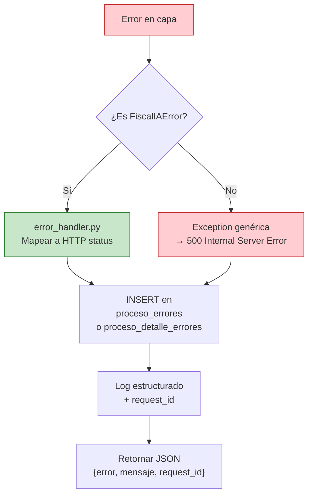

---

> **Autor:** FiscalIA Team  
> **Repositorio:** fiscalia-ia  
> **Licencia:** Uso interno — Municipio de Valledupar
